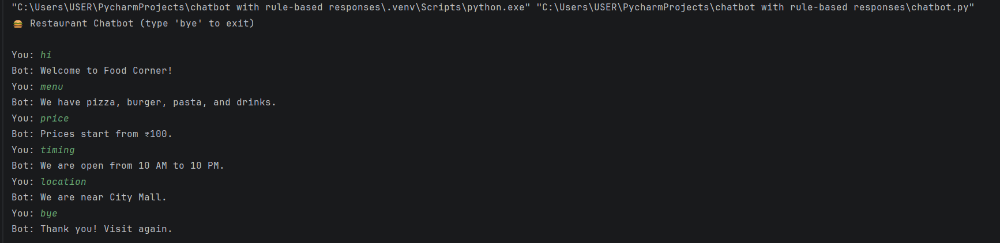

# 🤖 Simple Rule-Based Chatbot

## 📖 Overview
This project is a basic chatbot built using Python that interacts with users based on predefined rules.  
The chatbot identifies user queries using simple pattern matching techniques and responds accordingly.

It is designed as a beginner-friendly project to understand how chatbots work without using AI or machine learning.

---

## ⚙️ How It Works
- The chatbot takes input from the user
- It checks the input against predefined conditions
- Based on matching keywords or exact inputs, it returns a response
- The conversation continues until the user exits

---

## ✨ Key Features
- Rule-based response system
- Keyword-based pattern matching
- Continuous interaction loop
- Lightweight and easy to understand
- Beginner-friendly implementation

---

## 🧑‍💻 Tech Stack
- Python (Core Programming)

---

## ▶️ Execution Steps

1. Ensure Python is installed on your system  
2. Download or clone the repository:
   ```bash
   git clone https://github.com/your-username/chatbot.git
   
## Open the project directory:   
    cd chatbot

## Run the chatbot:
    python chatbot.py

## 📸 Screenshots

### 🖥️ Chatbot Interaction


   