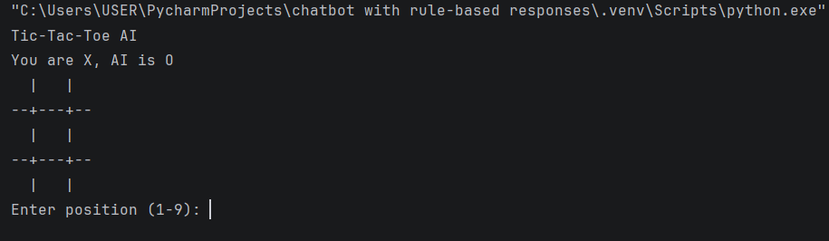
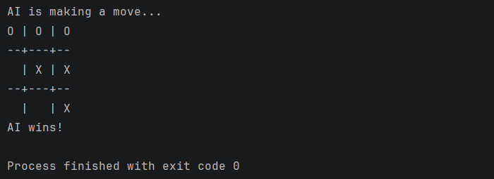

# 🎮 Tic-Tac-Toe AI 

## 📌 Overview
This project implements an **AI-powered Tic-Tac-Toe game** where a human player competes against an unbeatable AI.  
The AI uses the **Minimax algorithm**, a decision-making algorithm commonly used in game theory.

---

## 🚀 Features
- 🤖 Unbeatable AI using Minimax algorithm  
- 👤 Human vs AI gameplay  
- 🧠 Intelligent move selection  
- 💻 Simple command-line interface  
- ⚡ Fast and efficient gameplay  

---

## 🛠️ Technologies Used
- Python  
- Minimax Algorithm  
- Basic Game Logic  

---

## ▶️ How to Run the Project

## 1. Clone the Repository
    ```bash
     git clone https://github.com/your-username/your-repo-name.git

## 2. Navigate to the Folder
     cd your-repo-name

## 3.Run the Program
     python game.py

## 📸 Screenshots

### 🔹 Input


### 🔹 Output


